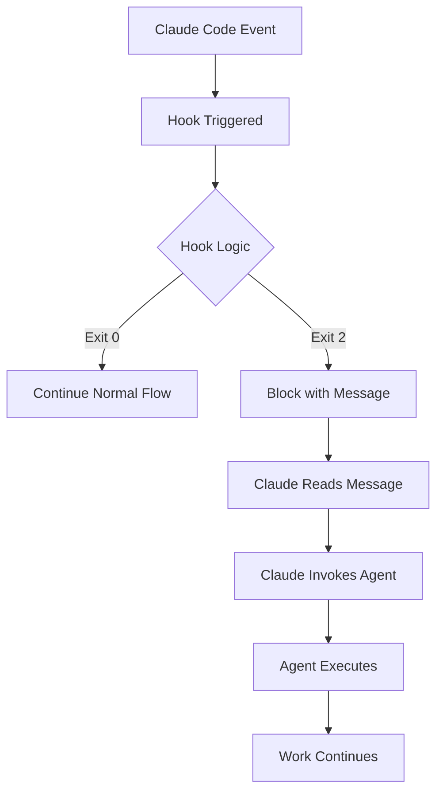

# Quaestor Hooks + Claude Code Agents Integration

## Overview

This document describes the integration between Quaestor's hook system and Claude Code's native subagent feature. The integration creates an intelligent development workflow where hooks guide Claude to use appropriate specialized agents at the right times.

## Architecture



## How It Works

Since hooks cannot directly invoke agents, we use a guidance pattern:

1. **Hooks detect conditions** that warrant agent usage
2. **Exit code 2 blocks execution** and shows a message to Claude
3. **Messages include specific agent invocation instructions**
4. **Claude reads the message** and decides to use the suggested agent
5. **Agents execute** with context from the hook message

## Hook Components

### 1. Workflow Enforcement Hooks

#### compliance_pre_edit.py
- **Trigger**: Before Write/Edit/MultiEdit operations
- **Purpose**: Enforce research→plan→implement workflow
- **Agent Suggestions**:
  - `researcher` - When attempting edits without research
  - `planner` - When no active milestone exists
  - `workflow-coordinator` - For complex workflow violations

#### research_workflow_tracker.py
- **Trigger**: After Read/Grep operations
- **Purpose**: Track research progress and guide phase transitions
- **Agent Suggestions**:
  - `planner` - When research phase complete (5+ files)
  - `implementer` - When planning phase complete

### 2. Progress Tracking Hooks

#### milestone_tracker.py
- **Trigger**: After Write/Edit operations
- **Purpose**: Track milestone progress and detect completion
- **Agent Suggestions**:
  - `milestone-manager` - When milestone 100% complete
  - `compliance-enforcer` - When tracking issues detected
  - `planner` - When no milestone exists

#### memory_tracker.py
- **Trigger**: After TodoWrite operations
- **Purpose**: Sync MEMORY.md with TODO completions
- **Agent Suggestions**:
  - `architect` - When documentation is stale
  - `architect` - When milestone nearing completion
  - `architect` - When architectural changes detected

### 3. Coordination Hooks

#### todo_agent_coordinator.py
- **Trigger**: After TodoWrite operations
- **Purpose**: Analyze TODO patterns and suggest agents
- **Agent Suggestions**:
  - `qa` - When many high-priority TODOs completed
  - `milestone-manager` - When approaching milestone completion
  - `architect` - When documentation lag detected
  - `planner` - When progress stalled

#### session_context_loader.py
- **Trigger**: On SessionStart
- **Purpose**: Load project context at session start
- **Output**: Injects context about active work and suggested agents

## Agent Components

### 1. milestone-manager
**Purpose**: Manages milestone lifecycle and PR creation

**Key Responsibilities**:
- Update milestone progress accurately
- Create comprehensive PR descriptions
- Archive completed milestones
- Suggest next milestone

**Triggered By**:
- milestone_tracker.py (on completion)
- todo_agent_coordinator.py (near completion)

### 2. workflow-coordinator
**Purpose**: Orchestrate research→plan→implement workflow

**Key Responsibilities**:
- Manage phase transitions
- Coordinate agent handoffs
- Detect workflow violations
- Maintain workflow state

**Triggered By**:
- compliance_pre_edit.py (violations)
- Manual invocation for complex workflows

### 3. compliance-enforcer
**Purpose**: Fix tracking issues and ensure compliance

**Key Responsibilities**:
- Audit project compliance
- Fix tracking discrepancies
- Update stale documentation
- Enforce best practices

**Triggered By**:
- milestone_tracker.py (tracking issues)
- compliance_validator.py (failures)

## Common Workflows

### 1. New Feature Implementation

```
User: "Implement user authentication"
         ↓
SessionStart Hook: Injects workflow guidance
         ↓
User tries to edit → compliance_pre_edit blocks
         ↓
"Use researcher agent to analyze codebase"
         ↓
Research phase → research_workflow_tracker counts files
         ↓
5 files examined → "Use planner agent"
         ↓
Plan created → "Use implementer agent"
         ↓
Implementation → milestone_tracker monitors
         ↓
TODOs complete → "Use milestone-manager for PR"
```

### 2. Milestone Completion

```
TodoWrite marks final task complete
         ↓
todo_milestone_connector detects 100%
         ↓
milestone_tracker confirms completion
         ↓
"Use milestone-manager agent to create PR"
         ↓
Agent creates PR with full description
         ↓
Suggests next milestone
```

### 3. Documentation Update

```
Multiple TODOs completed
         ↓
memory_tracker detects stale MEMORY.md
         ↓
"Use architect agent to update documentation"
         ↓
Agent updates architectural decisions
         ↓
Documentation current
```

## Hook Message Examples

### Workflow Violation
```
⚠️ WORKFLOW VIOLATION: Attempting to edit implementation files without proper research!

File: src/auth/login.py
Current phase: idle
Files researched: 0

REQUIRED WORKFLOW:
1. Research phase: Understand existing patterns and dependencies
2. Planning phase: Create implementation strategy
3. Implementation phase: Make code changes

Please run: Use the researcher agent to analyze the codebase before making changes
```

### Milestone Complete
```
🎉 Milestone 'user-authentication' is 100% complete!

REQUIRED: Create a pull request for this completed milestone.

Please run: Use the milestone-manager agent to create a PR for the completed milestone 'user-authentication'

The milestone-manager agent should:
1. Generate a comprehensive PR description
2. List all completed tasks and features
3. Include test coverage information
4. Create the PR using gh CLI
```

### Documentation Needed
```
📚 DOCUMENTATION LAG DETECTED!

Completed 8 TODOs but No entry for today, last updated 36.2 hours ago.

Please run: Use the architect agent to update project documentation and memory

The architect agent should:
1. Review all 8 completed TODOs
2. Update MEMORY.md with architectural decisions
3. Document any new patterns introduced
```

## Configuration

### automation_base.json Structure

```json
{
  "hooks": {
    "PreToolUse": [
      {
        "matcher": "Write|Edit|MultiEdit",
        "hooks": [
          {
            "type": "command",
            "command": "{python_path} {project_root}/src/quaestor/claude/hooks/compliance_pre_edit.py"
          }
        ]
      }
    ],
    "PostToolUse": [
      {
        "matcher": "TodoWrite",
        "hooks": [
          {
            "type": "command",
            "command": "{python_path} {project_root}/src/quaestor/claude/hooks/todo_agent_coordinator.py"
          }
        ]
      }
    ],
    "SessionStart": [
      {
        "hooks": [
          {
            "type": "command",
            "command": "{python_path} {project_root}/src/quaestor/claude/hooks/session_context_loader.py"
          }
        ]
      }
    ]
  }
}
```

## Best Practices

### 1. Hook Design
- Use exit code 2 sparingly to avoid frustration
- Make messages actionable with specific commands
- Provide context about why agent is needed
- Include what the agent should do

### 2. Agent Suggestions
- Be specific about which agent to use
- Provide clear task description for agent
- Include relevant context from hook
- List expected outcomes

### 3. Message Format
```
[EMOJI] [SITUATION SUMMARY]

[DETAILS ABOUT WHAT WAS DETECTED]

Please run: Use the [agent-name] agent to [specific task]

The [agent-name] agent should:
1. [Specific action 1]
2. [Specific action 2]
3. [Specific action 3]

[WHY THIS IS IMPORTANT]
```

## Troubleshooting

### Hook Not Triggering
1. Check automation_base.json configuration
2. Verify hook file has execute permissions
3. Check hook Python syntax
4. Review Claude Code debug output

### Agent Not Being Used
1. Make message more compelling
2. Ensure exit code 2 is used
3. Verify agent exists in .claude/agents/
4. Check agent description matches use case

### Workflow Stuck
1. Check .workflow_state file
2. Reset workflow if needed
3. Manually invoke workflow-coordinator
4. Review recent hook outputs

## Future Enhancements

### Planned Features
1. **Hook Analytics**: Track which suggestions lead to agent use
2. **Smart Batching**: Group related agent suggestions
3. **Context Passing**: Enhanced context transfer to agents
4. **Learning System**: Adapt suggestions based on user patterns

### Integration Points
1. **A1 System**: Intelligent rule enforcement
2. **Command System**: Hook-triggered commands
3. **CI/CD**: Automated compliance in pipelines

## Summary

This integration creates a guided development experience where:
- Hooks enforce best practices automatically
- Agents are suggested at optimal times
- Workflow violations are prevented
- Documentation stays current
- Milestones are properly tracked

The system respects Claude Code's architecture while adding intelligent guidance that improves development outcomes.