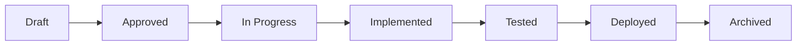

# /project-init - Intelligent Project Initialization

## Purpose
Analyze project architecture, detect frameworks and patterns, then generate intelligent Quaestor setup with auto-populated documentation and specifications.

## Usage
```
/project-init
/project-init --type web-api
/project-init --existing --migrate
```

## Auto-Intelligence

### Framework Detection
```yaml
Stack Analysis:
  - Language: Auto-detect → Python|Rust|JS|TS|Go standards
  - Framework: React|Django|Express|FastAPI|Axum patterns
  - Architecture: MVC|DDD|VSA|Microservices detection
  - Patterns: Repository|Service|CQRS|Event-driven
```

### Adaptive Setup
- **New projects**: Generate starter architecture + specifications
- **Existing projects**: Analyze current state + fill gaps
- **Migration**: Import existing docs + enhance with Quaestor

## Execution: Analyze → Generate → Validate → Setup

### Phase 1: Project Analysis 🔍

**Agent-Orchestrated Discovery:**

Use the Task tool to spawn specialized agents for parallel analysis:

```yaml
Parallel Agent Execution:
  1. Framework & Dependency Analysis:
     Agent: researcher
     Mission: "Analyze the project structure and identify:
       - Primary programming language and framework
       - Project dependencies from package.json/requirements.txt/Cargo.toml/go.mod
       - Test framework and current coverage
       - Build tools and scripts
       Output as structured YAML with framework, dependencies, and tools"
  
  2. Architecture Pattern Analysis:
     Agent: architect
     Mission: "Evaluate the codebase architecture:
       - Identify architecture patterns (MVC, DDD, VSA, Clean Architecture)
       - Map component relationships and boundaries
       - Assess API design patterns
       - Analyze database architecture
       - Identify technical debt and complexity hotspots
       Output as structured analysis with patterns, strengths, and concerns"
  
  3. Security Assessment:
     Agent: security
     Mission: "Perform security analysis on the project:
       - Identify security patterns and anti-patterns
       - Check for common vulnerabilities
       - Assess authentication/authorization approach
       - Review data handling and encryption
       - Evaluate dependency security
       Output as security assessment with risks and recommendations"
```

**Result Consolidation:**
After all agents complete, consolidate findings into a unified analysis:
```yaml
Consolidated Analysis:
  Framework: [from researcher]
  Architecture: [from architect]
  Security: [from security]
  Complexity: [calculated score]
  Phase: [new|growth|legacy based on analysis]
```

### Phase 2: Intelligent Generation ⚡
**Agent-Driven Specification Creation:**

Use the planner agent to generate specifications based on consolidated analysis:

```yaml
Specification Generation:
  Agent: planner
  Context: [Consolidated analysis from Phase 1]
  Mission: "Based on the project analysis, create initial specifications:
    - Project type: [framework] in [phase] phase
    - Architecture: [patterns identified]
    - Security concerns: [from security analysis]
    - Current gaps: [from architect analysis]
    
    Generate 3-5 initial specifications that address:
    1. Foundation/setup needs for this project type
    2. Architecture improvements based on patterns found
    3. Security enhancements needed
    4. Technical debt identified
    5. Testing/quality improvements
    
    For each specification provide:
    - Title and description
    - Priority (critical/high/medium/low)
    - Estimated effort
    - Dependencies
    
    Output as structured YAML suitable for Quaestor specifications"
```

**Document Generation:**
Based on agent outputs, generate:
```yaml
Generated Documents:
  - ARCHITECTURE.md: From architect agent analysis
  - MEMORY.md: With specifications from planner agent
  - .quaestor/specifications/: Initial spec files
  - CRITICAL_RULES.md: Framework-specific from analysis
```

### Phase 3: User Validation ✅ **[MANDATORY - DO NOT SKIP]**

⚠️ **CRITICAL ENFORCEMENT RULE:**
```yaml
before_phase_4:
  MUST_PRESENT_ANALYSIS:
    - framework_detection_results
    - architecture_pattern_analysis  
    - proposed_specifications
    - quality_standards_detected
  
  MUST_GET_USER_CHOICE:
    options:
      - "✅ Proceed with detected setup"
      - "🔄 Modify detected patterns" 
      - "📝 Custom architecture description"
      - "🚫 Start with minimal setup"
  
  VIOLATION_CONSEQUENCES:
    - if_skipped: "IMMEDIATE STOP - Restart from Phase 3"
    - required_response: "I must validate this analysis with you before proceeding"
```

**MANDATORY Interactive Confirmation Template:**
```
## Project Analysis Validation ✋

**Detected Configuration:**
- Framework: [detected_framework]
- Architecture: [detected_pattern]
- Complexity: [score]/1.0
- Phase: [project_phase]

**Proposed Specifications:**
1. [spec-001]: [Title] (priority: [high/medium/low])
   - Type: [feature/enhancement/bugfix]
   - Estimated: [duration]
   - Description: [brief description]
   
2. [spec-002]: [Title] (priority: [high/medium/low])
   - Type: [feature/enhancement/bugfix]
   - Estimated: [duration]
   - Description: [brief description]
   
3. [spec-003]: [Title] (priority: [high/medium/low])
   - Type: [feature/enhancement/bugfix]
   - Estimated: [duration]
   - Description: [brief description]

**Quality Standards:**
[detected_tools_and_standards]

## Your Options:
- ✅ Proceed with detected setup and specifications
- 🔄 Modify specification list
- 📝 Define custom specifications
- 🚫 Start with minimal setup

## Specification Creation:
- ⭐ Create specification files (.quaestor/specifications/*.yaml)
- 📝 Documentation only (just populate MEMORY.md templates)

What would you prefer for setup and specifications?
```

### Phase 4: Setup Completion 🚀 **[ONLY AFTER USER APPROVAL]**

**Document Generation:**
```yaml
Template Selection:
  - Framework-specific: React|Django|Express templates
  - Pattern-specific: MVC|DDD|VSA structures
  - Size-appropriate: Startup|Enterprise|Legacy setups
  
Auto-Population:
  - Real paths from project structure
  - Detected components and responsibilities
  - Inferred specifications from git history
  - Framework-specific quality standards
```

**Conditional Specification Creation:**
```yaml
if_user_chose_specification_files:
  actions:
    - create_directories: ".quaestor/specifications/"
    - generate_readme: "Goals, success criteria, timeline"
    - create_spec_yaml: "Specification with contract and acceptance criteria"
    - initialize_notes: "Implementation notes and decisions"
  
if_user_chose_documentation_only:
  actions:
    - populate_memory_templates: "Update MEMORY.md with specification information"
    - skip_specification_directories: "No .quaestor/specifications/ creation"

mandatory_for_both:
  - populate_architecture_md: "Real project analysis"
  - update_critical_rules: "Framework-specific guidelines"
  - configure_quality_standards: "Testing and linting setup"
```

## Framework-Specific Intelligence

### React/Frontend Projects
```yaml
React Analysis:
  State Management: Redux|Context|Zustand detection
  Component Patterns: HOC|Hooks|Render Props
  Architecture: SPA|SSR|Static Site patterns
  Quality Gates: ESLint + Prettier + TypeScript
  
Generated Specifications:
  - Component Library Setup
  - State Management Implementation
  - Testing Infrastructure
  - Performance Optimization
```

### Python/Backend Projects
```yaml
Python Analysis:
  Framework: Django|FastAPI|Flask detection
  Patterns: MVC|Repository|Service Layer
  Testing: pytest|unittest setup
  Quality Gates: ruff + mypy + pytest
  
Generated Specifications:
  - API Design & Models
  - Authentication System
  - Database Integration
  - Production Deployment
```

## Agent Error Handling

**Graceful Degradation for Agent Failures:**
```yaml
Error Handling Strategy:
  If researcher agent fails:
    - Fall back to basic file detection (package.json, requirements.txt)
    - Log: "Framework detection limited - manual review recommended"
    - Continue with available data
  
  If architect agent fails:
    - Use simplified pattern detection based on folder structure
    - Log: "Architecture analysis incomplete - patterns may be missed"
    - Continue with basic analysis
  
  If security agent fails:
    - Flag for manual security review
    - Log: "Security assessment skipped - manual review required"
    - Continue without security recommendations
  
  If planner agent fails:
    - Generate basic specification templates
    - Log: "Specification generation limited - customize as needed"
    - Provide manual specification guide

Performance Monitoring:
  - Total time limit: 30 seconds
  - Individual agent timeout: 10 seconds
  - Parallel execution to maximize efficiency
```

## Specification-Driven Workflow Guide

### Understanding Specifications
**What is a Specification?**
```yaml
Specification Structure:
  - ID: Unique identifier (e.g., spec-auth-001)
  - Title: Clear, actionable description
  - Type: feature|enhancement|bugfix|refactor|documentation
  - Priority: critical|high|medium|low
  - Contract: Defines inputs, outputs, and behavior
  - Acceptance Criteria: Measurable success conditions
  - Test Scenarios: Validation requirements
```

### Specification Lifecycle


### Creating Specifications
**Agent-Generated Specification Example:**
```yaml
spec_id: "spec-auth-001"
title: "Implement JWT-based authentication"
type: "feature"
priority: "high"

contract:
  inputs:
    username: string (required)
    password: string (required, min 8 chars)
  outputs:
    token: JWT string
    user: User object
  behavior:
    - Validate credentials against database
    - Generate JWT with 24h expiration
    - Handle invalid credentials gracefully

acceptance_criteria:
  - User can login with valid credentials
  - Invalid credentials return 401 error
  - Token expires after 24 hours
  - Refresh token mechanism works

test_scenarios:
  - name: "Valid login"
    given: "User with correct credentials"
    when: "Login endpoint is called"
    then: "JWT token is returned"
```

### Working with Specifications
**Commands:**
- `/plan --spec` - Create new specification
- `/impl spec-id` - Implement a specification
- `/plan` - View specification progress

**Workflow:**
1. Agent analysis generates initial specifications
2. Review and approve specifications
3. Link specification to feature branch
4. Implement according to contract
5. Validate against acceptance criteria
6. Update status through lifecycle

### Agent Invocation Examples
**How Agents Work Together:**
```yaml
Phase 1 - Parallel Analysis:
  researcher agent:
    Input: Project directory
    Output: Framework, dependencies, tools
    Example: "Detected: React 18.2, TypeScript 5.0, Jest, ESLint"
  
  architect agent:
    Input: Codebase structure
    Output: Patterns, architecture, complexity
    Example: "Found: Component-based, Redux state, 0.7 complexity"
  
  security agent:
    Input: Code and dependencies
    Output: Vulnerabilities, recommendations
    Example: "2 outdated deps, auth pattern needed"

Phase 2 - Specification Generation:
  planner agent:
    Input: Consolidated analysis from Phase 1
    Output: Prioritized specifications
    Example Output:
      spec-001: Upgrade dependencies (critical)
      spec-002: Add authentication (high)
      spec-003: Refactor state management (medium)
```

**Visual Specification Roadmap:**
```
┌─────────────────────┐     ┌─────────────────────┐     ┌─────────────────────┐
│   Foundation        │     │   Core Features     │     │   Enhancement       │
│   (Week 1-2)        │ --> │   (Week 3-6)        │ --> │   (Week 7+)         │
├─────────────────────┤     ├─────────────────────┤     ├─────────────────────┤
│ • spec-001: Setup   │     │ • spec-004: API     │     │ • spec-007: Perf    │
│ • spec-002: Auth    │     │ • spec-005: CRUD    │     │ • spec-008: Scale   │
│ • spec-003: DB      │     │ • spec-006: Tests   │     │ • spec-009: Monitor │
└─────────────────────┘     └─────────────────────┘     └─────────────────────┘
```

## Adaptive Specification Generation
**Smart Phase Detection:**
```yaml
Project Analysis → Specification Generation:
  - New projects: Foundation → Core → Polish phases
  - In-progress: Analyze git history → identify next logical phase
  - Legacy: Assessment → Modernization → Enhancement
  
Example Specification Sets:
  Startup (0-6 months):
    - "MVP Foundation"
    - "Core Features"
    - "User Feedback Integration"
  
  Growth (6-18 months):
    - "Performance Optimization"
    - "Feature Expansion"
    - "Production Hardening"
  
  Enterprise (18+ months):
    - "Architecture Evolution"
    - "Scalability Improvements"
    - "Platform Maturation"
```

## Success Criteria
**Initialization Complete:**
- ✅ Framework and architecture accurately detected
- ✅ **USER VALIDATION COMPLETED** ← **MANDATORY**
- ✅ Documents generated with real project data
- ✅ Specifications aligned with project phase and goals
- ✅ Quality standards configured for tech stack
- ✅ First specification ready for /impl execution

**Framework Integration:**
- ✅ Language-specific quality gates configured
- ✅ Testing patterns and tools detected
- ✅ Build and deployment awareness established
- ✅ Performance benchmarks appropriate for stack

### Real-World Validation Example
**What Users Actually See:**
```
## Project Analysis Validation ✋

**Detected Configuration:**
- Framework: React with TypeScript
- Architecture: Component-based with Redux
- Complexity: 0.7/1.0
- Phase: Growth (6-18 months)

**Proposed Specifications:**
1. [spec-auth-001]: JWT Authentication System (priority: high)
   - Type: feature
   - Estimated: 2 weeks
   - Description: Implement secure JWT-based auth with refresh tokens
   
2. [spec-api-002]: REST API Integration Layer (priority: high)
   - Type: enhancement
   - Estimated: 1 week
   - Description: Create typed API client with error handling
   
3. [spec-perf-003]: Component Performance Optimization (priority: medium)
   - Type: enhancement
   - Estimated: 1 week
   - Description: Add React.memo and useMemo for heavy components

**Quality Standards:**
- Testing: Jest + React Testing Library
- Linting: ESLint with Airbnb config
- Type checking: TypeScript strict mode
- CI/CD: GitHub Actions detected

## Your Options:
- ✅ Proceed with detected setup and specifications
- 🔄 Modify specification list
- 📝 Define custom specifications
- 🚫 Start with minimal setup

## Specification Creation:
- ⭐ Create specification files (.quaestor/specifications/*.yaml)
- 📝 Documentation only (just populate MEMORY.md templates)

What would you prefer for setup and specifications?
```

---
*Intelligent framework detection with adaptive project setup and auto-generated documentation*

